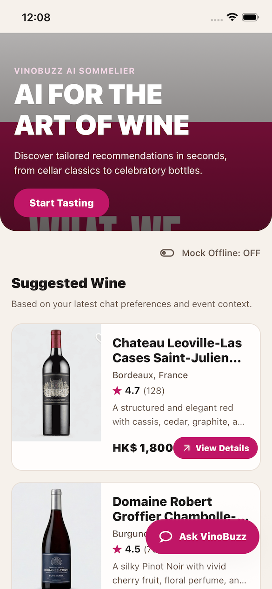
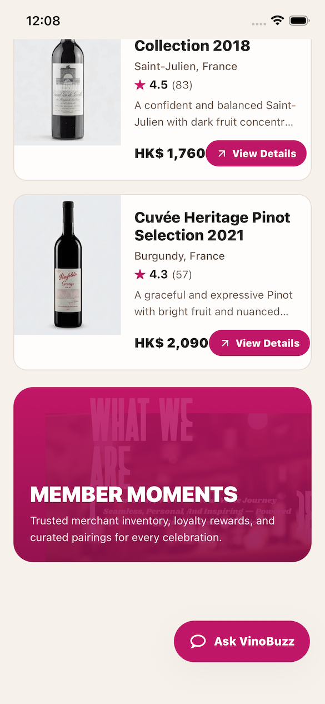
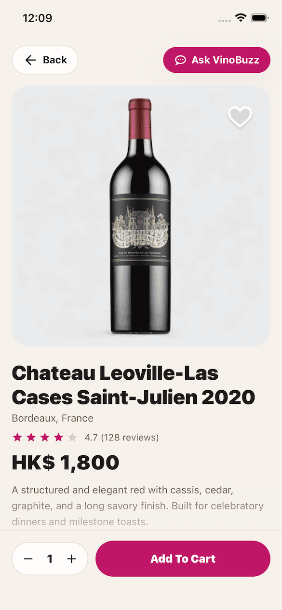
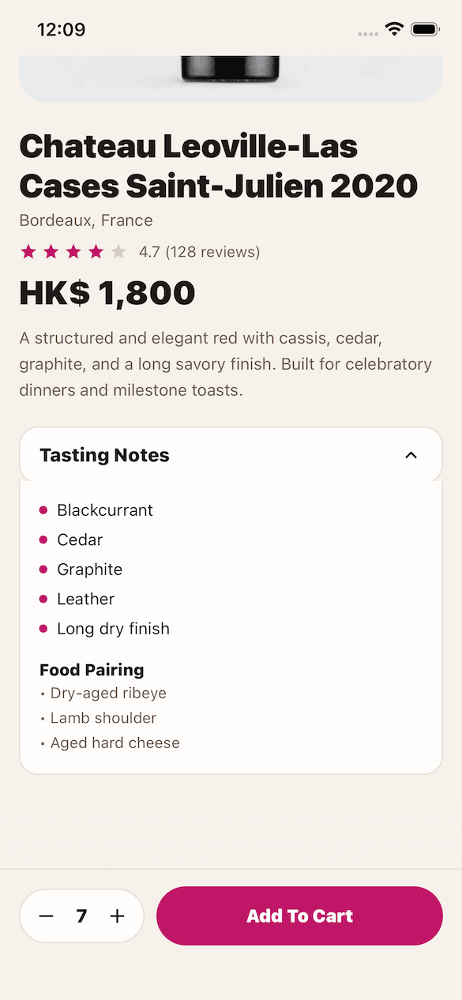
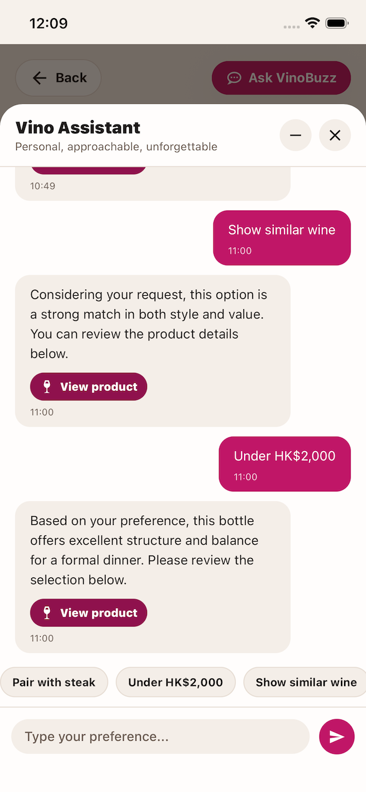
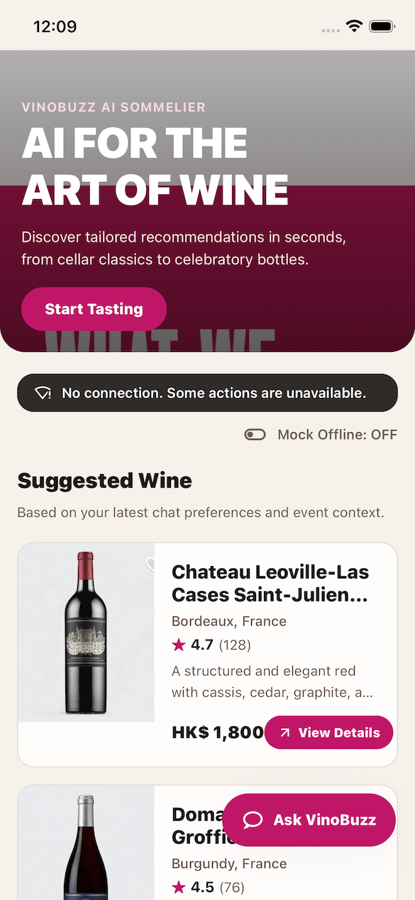

# VinoBuzz AI Mobile App Demo

Mobile prototype for the **VinoBuzz Senior Mobile Developer Assessment** using Expo 54, React 19.1.0, React Native 0.81.4.

Download apk file at: https://drive.google.com/file/d/1rsiGmbe2F_DGG78yGpObST778KmADaY_/view?usp=sharing

## Tech stack

### Navigation & platform

- `@react-navigation/native` `^7.1.6`
- `@react-navigation/native-stack` `^7.3.10`
- `expo-linking` `~8.0.8`
- `react-native-safe-area-context` `5.6.1`
- `react-native-gesture-handler` `~2.28.0`
- `react-native-screens` `4.16.0`
- `react-native-reanimated` `~4.1.3`

### UI & utilities

- `@expo/vector-icons` `^15.0.2`
- `expo-linear-gradient` `~15.0.7`
- `@react-native-community/netinfo` `^11.4.1`

### Local persistence

- `expo-file-system` a lightweight local persistence layer for chat history.

## Screenshots
### Home screen



### Product detail screen



### AI chat assistant screen


### Show a banner when offline

<br /><br />

## Implemented features

### AI Assistant overlay (in-app chat)

- Global chat overlay with 3 states: `hidden`, `minimized`, `expanded`.
- Assistant persona/UI: typing indicator, styled message bubbles, quick replies, and action message with **View product**.
- **Mock assistant reply delay 2–5 seconds** after each user message.
- Assistant reply can include a product suggestion and `View product` CTA that navigates to product detail.
- `Under HK$2,000` quick reply returns a real item with `price < 2000`.

### Chat persistence

- Chat message list persists across app reloads.
- Persistence implementation:
  - hydrate on startup from app document directory file
  - append/save on every message change
  - recover gracefully if local file is missing/corrupt
- Storage file: `vinobuzz-chat-messages.json` in app document directory.

### Product flows

- Home list with tappable full card item + `View details` CTA.
- Product Detail screen with:
  - image gallery
  - loading skeleton
  - pricing and quantity controls
  - sticky bottom Add-to-Cart section
- Floating `Ask VinoBuzz` button behavior adjusted to avoid blocking critical content.

### Navigation, deep links, and safety

- Stack flow: `Home -> ProductDetail`.
- Deep link support:
  - `vinobuzz://product/:id`
  - fallback `vinobuzz://:id`
- Safe-area-aware UI (top/bottom), including chat composer and iPhone home-indicator spacing.
- Offline banner with real network status + mock toggle for demo/testing.

## Run locally

### 1) Install (using bun package manager)

```bash
bun install
```

### 2) Start Metro

```bash
bun run start
```

### 3) Launch app

```bash
bun run ios
# or
bun run android
```

### 4) Type check

```bash
bun run typecheck
```

## Deep link test scenarios (iOS + Android)

> Precondition: app is installed and running on simulator/emulator/device.

### Scenario A — Open valid product from cold start

**Expected:** app launches directly to product detail with matching product.

iOS:

```bash
npx uri-scheme open vinobuzz://product/123 --ios
```

Android:

```bash
npx uri-scheme open vinobuzz://product/123 --android
```

### Scenario B — Open valid product while app is already running

**Action:** keep app on Home, run same command again.  
**Expected:** app navigates to detail screen (no crash, no duplicate navigator errors).

### Scenario C — Fallback link format

**Action:** test fallback format without `/product/`.  
**Expected:** same behavior as canonical format.

iOS:

```bash
npx uri-scheme open vinobuzz://123 --ios
```

Android:

```bash
npx uri-scheme open vinobuzz://123 --android
```

### Scenario D — Unknown product id

**Action:** open non-existing id.

```bash
npx uri-scheme open vinobuzz://product/99999 --ios
npx uri-scheme open vinobuzz://product/99999 --android
```

**Expected:** app handles gracefully (fallback/empty state) without crash.

### Scenario E — Chat + deep link interaction

**Action:** open chat overlay, keep it expanded, then trigger deep link.
**Expected:** navigation still works, chat overlay state remains stable, and no “navigation not initialized” error.

## Project structure

- `src/navigation/`: navigator + deep-link config
- `src/screens/`: `HomeScreen`, `ProductDetailScreen`
- `src/components/`: `ChatOverlay`, product cards/skeleton, offline banner, typing indicator
- `src/data/`: mock product/chat data
- `src/controllers/`: chat overlay open/close controller
- `assets/images/`, `assets/icons/`: UI assets and product images
